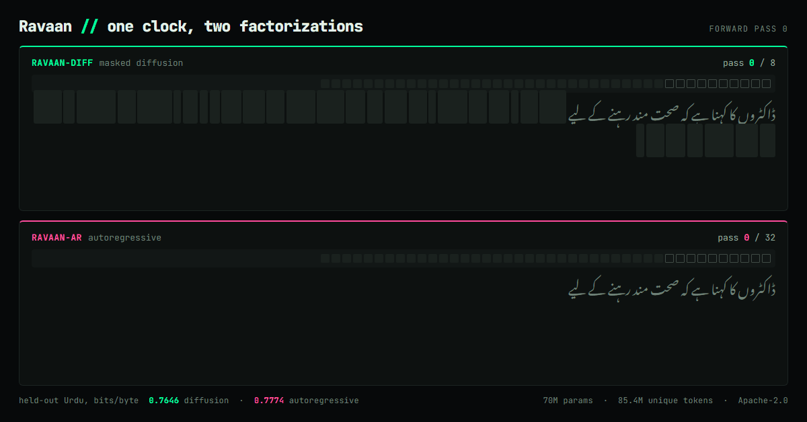

# Ravaan

**Does masked diffusion pay off for a genuinely low-resource language?**

Ravaan trains two ~70M-parameter Urdu language models that differ in exactly one thing — the
factorization — and measures where, if anywhere, their curves cross.

**Both models are trained, measured and public.**

| | held-out Urdu, bits/byte | epochs |
|---|---|---|
| [`ravaan-diff-70m`](https://huggingface.co/AwaisAdilKhokhar/ravaan-diff-70m) — masked diffusion | **0.7646** | 64 |
| [`ravaan-ar-70m`](https://huggingface.co/AwaisAdilKhokhar/ravaan-ar-70m) — autoregressive | 0.7774 | 4 |

Same corpus, same 85,362,688 unique tokens, same backbone, same tokenizer. **The autoregressive
model's best checkpoint is at 4 epochs** — train it four times longer and it gets measurably
worse. The diffusion model was trained sixteen times longer than that and had still not turned.
Each released checkpoint is its own arm's best, which is why the AR half is a 4-epoch model and
[its card says so](https://huggingface.co/AwaisAdilKhokhar/ravaan-ar-70m).

Two caveats that belong next to those numbers, not below the fold: the diffusion figure is an
**ELBO — an upper bound** — while the AR figure is exact, so this asymmetry can establish a
diffusion win and never an AR one; and each arm is **a single seed**, so the gap between them is
one paired comparison. The diffusion arm was separately replicated at a second seed and landed
0.29σ away.



*Left to right is not the only way to write a sentence. The diffusion model starts from a canvas
of masks and commits a subset of positions per forward pass, in whatever order it is surest
about; eight passes later there are none left. Both panels above run on the same clock, one tick
per forward pass. Rebuild with `python scripts/decoder_gif.py`.*

| | Ravaan-AR | Ravaan-DIFF |
|---|---|---|
| Attention | Causal | Bidirectional |
| Objective | Next-token prediction | Masked diffusion (MDLM-style, time-agnostic) |
| Infilling | FIM (prefix/suffix/middle) | Mask the middle span |

Same corpus, same tokenizer, same parameter count (within 2%), same context length, same optimizer
and schedule, same tokens processed, same seeds, **same training tasks**.

The motivating claim from the literature is that masked diffusion overtakes autoregression when
compute is abundant but unique data is scarce. Prabhudesai et al. ([arXiv:2507.15857]) measured
that on clean English C4 and fitted a critical-compute threshold. Urdu web text is noisier, more
duplicated and more domain-skewed, and the script, morphology and tokenizer fertility all differ.
**Does the law transfer?**

Two arms, both processing ~9.9B tokens, differing only in how much unique data those tokens are
drawn from — because compute is parameters × tokens *processed*, so unique data is free:

| Arm | Unique U | Epochs | Seeds | Predicted |
|---|---|---|---|---|
| **A** (primary) | 25M | ~396 | 3 | **1.79× past** the fitted crossover |
| **B** (bracket) | 100M | ~99 | 1 | **0.09× of** it |

Arm A is predicted to cross and arm B is not, so the paired outcome tests the crossover's
*location*, not merely its sign. Both arms sit **inside** the reference paper's fitted range of U,
so no claim here depends on extrapolating their law. The predictions are committed in
[`reports/preregistration.md`](reports/preregistration.md), written before any training.

**This is not an Urdu chat model, and it will not become one.**

[arXiv:2507.15857]: https://arxiv.org/abs/2507.15857

The full specification lives in [`Ravaan_PRD_v2.md`](Ravaan_PRD_v2.md). Session-by-session status
lives in [`progress.md`](progress.md).

---

## Status

**Released.** Both arms are trained on the frozen corpus and published under Apache-2.0 as a
matched pair, with safetensors weights, a vendored torch-only `ravaan_infer/` package (the
diffusion model is not a `transformers` architecture and `AutoModel` cannot load it), and model
cards carrying the caveats above.

Neither released checkpoint reproduces its training data: 16-, 32-, 64- and 128-gram overlap
against the corpus is 0.000 for both, measured on the released weights rather than inherited,
with held-out Urdu as a control so the zeros mean something
([`reports/eval/overlap_release.json`](reports/eval/overlap_release.json)).

What is *not* done: no native speakers were recruited to score generations, so **every Urdu
quality judgement in this project is a model's or the author's**. Gate G3's coherence bar is
unmet. See [`progress.md`](progress.md) for the full findings register.

### Reproducing the demo

```bash
python scripts/demo_trace.py      # sample both released models, recording per-token commit order
python scripts/decoder_demo.py    # -> reports/decoder_demo.html  (the interactive page)
python scripts/decoder_gif.py     # -> reports/decoder_demo.gif   (the animation above)
```

`demo_trace.py` asserts its traced diffusion loop reproduces the shipped sampler token-for-token
on every run, so the animation is the real decoder rather than an illustration of one. Samples
are the best of 16 seeds per arm under a fixed rule applied identically to both; every rejected
draw ships in `reports/demo_trace_pool.json` with the reason it lost.

## Layout

```
configs/            data, tokenizer, model, training, sampling, eval configs
ravaan/
  data/             acquisition, normalization, langid, dedup, quality, corruption, packing
  tokenization/     SentencePiece Unigram 16k + fertility benchmark
  models/           shared backbone, ar/, diffusion/
  training/         loop, config, packed-corpus loader, §4.2's task mixture
  sampling/         both decoders, §4.2's framings for inference, §4.4's A3/A4
  evaluation/       §8.3's generation metrics
tests/              engineering invariants (PRD §8.1) — these are CI, never results
scripts/
demo/               HF Space
reports/            preregistration, literature review, technical report
```

## Install

```bash
python -m pip install -e ".[dev]"
# add extras as the pipeline needs them: .[data] .[tokenizer] .[train]
```

The core package has no runtime dependencies. Every stage that *decides* something — acquisition,
encoding validation, language ID, normalization, quality filtering, exact and near dedup, and
evaluation decontamination — is standard-library-only on purpose: they choose which bytes the
project is built on and what every later stage reads, so they stay auditable. Heavy dependencies
are opt-in extras, and `[data]` is needed only to *read* the corpus, where parquet must be parsed.

## Test

```bash
python -m pytest
```

## Corpus pipeline

```bash
python scripts/acquire.py plan                        # sources, licences, sizes, fingerprint
python scripts/acquire.py fetch --max-bytes 3e9       # download, verify, record the manifest
python scripts/acquire.py verify                      # re-check what is on disk
python scripts/validate_encoding.py shard.jsonl --jsonl -o clean.jsonl
python scripts/normalize.py raw.txt -o clean.txt --log stats.json

# what the stages actually do on real text — every threshold gets one of these before the freeze
python scripts/probe.py --source fineweb2-urd_Arab --limit 20000 --sample-rate 0.02   # stages 2-5
python scripts/dedup.py --source urdu-wikipedia --limit 250000                        # stage 6
python scripts/neardedup.py --source urdu-wikipedia --limit 0 --sweep 0.7 0.8 0.9      # stage 7
python scripts/decontaminate.py --eval roman-urdu-parl:test \
    --source roman-urdu-parl --split train --both-columns --limit 0                    # stage 8
python scripts/split.py --source urdu-wikipedia --limit 0 --measure-only                # stage 9
python scripts/pack.py --source urdu-wikipedia --limit 0 --measure-only                 # stage 10

# the freeze order is 6 -> 7 -> 9 -> 8 -> 10, and the stages hand ids forward rather than chaining
# in one process. `--removals` writes a list; `--exclude` applies it, and refuses one computed over
# a different read of the corpus — a list from a sampled or limited pass is otherwise
# indistinguishable from one over the whole thing.
python scripts/neardedup.py --source urdu-wikipedia --limit 0 \
    --removals reports/freeze/removals_67_wikipedia.txt
python scripts/split.py --source urdu-wikipedia --limit 0 --measure-only \
    --exclude reports/freeze/removals_67_wikipedia.txt --plan-out plan.json

# the 200-sample manual validation PRD §6.3.5 requires
python scripts/quality_sample.py draw --out reports/quality_sample.md
```

PRD §6.3's PII pass (one regex for phone numbers and emails, and explicitly *not* a PII system)
runs inside every driver above, between stage 5 and stage 6 — see `reports/pii.md`. `probe.py`
reports what it fired on, and `ravaan-pii` runs it over a single file.

Fixture tests prove a rule does what it says; only real text shows whether it fires on the right
things. Session 4 found a mojibake detector that passed 57 unit tests and would have deleted 3% of
a clean corpus, so every threshold in stages 2, 3, 5, 6, 7 and 8 and in the PII pass is pointed at
the actual sources before the corpus is frozen, and the output is committed under
`reports/probe_*.json`. Session 10 is the sharpest case: stage 8's first run over real text
reported 648 contaminated documents, and reading them showed 59 of every 60 was a false positive
from a threshold that meant one thing in words and another in characters. Session 13 is the
cheapest: eleven of the PII pass's first thirteen phone matches on Urdu Wikipedia were ISBNs.

Sources are declared in [`configs/data/sources.json`](configs/data/sources.json): every source
pinned to a commit SHA, every file carrying its SHA-256 before download, and every licence checked
against what PRD §6.3 promises to ship. Sources that were considered and declined stay in the file
with their reasons — the corpus cap is a design decision, and that is only checkable if what was
declined sits next to what was taken.

## Data and release policy

No raw text is redistributed. This repository ships code, a corpus manifest, checksums, and
statistics only (PRD §6.3). One permissive checkpoint will be released.

## License

Apache-2.0. See [`LICENSE`](LICENSE).
